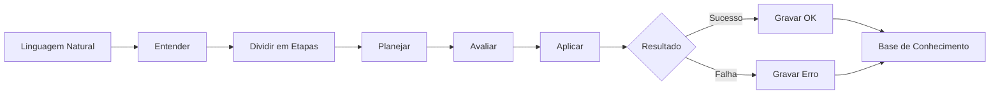

# Filosofia e Fundamentos do FazAI

## Visão Geral

O FazAI é um orquestrador modular que combina inteligência artificial com administração de sistemas Linux. O objetivo é criar uma ferramenta que não apenas execute comandos, mas que aprenda e evolua continuamente através da experiência.

## Princípios Fundamentais

### 1. Arquitetura Híbrida

- **Inferência Local**: Núcleo baseado em llama.cpp (gptOSS-20b) para autonomia e privacidade
- **APIs Remotas de Apoio**: Suporte a OpenAI, Anthropic Claude e outros modelos como complemento
- **Modularidade**: Cada componente pode ser substituído ou atualizado independentemente

### 2. Sistema de Memória Dual

O FazAI utiliza duas coleções vetoriais distintas com propósitos complementares:

#### `fazai_memory` - Personalidade e Contexto
- Armazena a "personalidade" de cada agente/assistente
- Mantém o contexto de interações passadas
- Funciona como a "casa" onde cada agente vive e evolui
- Transparente ao modelo (peso) utilizado
- Exemplos: vetorização da história de Claudio, Mia, e outros agentes

#### `fazai_kb` - Base de Conhecimento Técnica
- Fonte de inferência técnica proprietária
- Documentações específicas e soluções customizadas
- Conhecimento especializado que complementa o modelo base
- Consultável via MCP (Model Context Protocol) tools

**Infraestrutura Vetorial**:
- Suporte a Qdrant (disponível em: 192.168.0.103)
- Suporte a Zilliz/Milvus para escalabilidade
- Configuração flexível de dimensões e métricas de distância

### 3. Aprendizado Contínuo - "Deduplica��o ZFS"

O sistema aprende de forma análoga à deduplica��o do ZFS:

```
Ordem Natural → Etapas → Execução → Resultado
                  ↓
         Unidade de Conhecimento
                  ↓
    Reutilização em Novos Contextos
```

**Quando FALHA**:
- Grava na memória a condição e o cenário completo
- Registra o contexto do erro para aprendizado futuro
- Evita repetir os mesmos erros

**Quando SUCESSO**:
- Grava como solução válida (OK)
- A pequena unidade de solução pode ser parte de outras ordens
- Blocos de conhecimento reutilizáveis em diversos contextos

Este conceito permite que menores unidades de informa��o sejam aproveitadas em diversos contextos, arquivos e situações - maximizando a eficiência do aprendizado.

### 4. Fluxo de Execução



#### Fases do Processo:

1. **Entender**: Interpretar a ordem em linguagem natural
2. **Dividir**: Quebrar em etapas menores e gerenciáveis
3. **Planejar**: Definir sequência de ações e dependências
4. **Avaliar**: 
   - Analisar o ambiente atual
   - Verificar dependências
   - Identificar possíveis problemas
   - Avaliar riscos
5. **Aplicar**: Executar as ações planejadas
6. **Aprender**: Registrar resultado para uso futuro

### 5. Ferramentas e Integra��es

#### MCP (Model Context Protocol)
- Carregamento remoto de ferramentas (tools)
- Compatível com desktop-remote da Anthropic
- Suporte ao CUA da OpenAI
- Extensível para novos provedores

#### Pesquisa e Contexto
- Acesso à internet quando necessário
- Integração com Context7 para busca contextual
- Fallback inteligente entre fontes de informação

#### Configuração
- Arquivo `fazai.conf` para chaves e endpoints
- Suporte a variáveis de ambiente
- Configuração de múltiplos provedores de IA

### 6. Segurança em Camadas

1. **Pattern Matching**: Bloqueio de comandos perigosos conhecidos
2. **Avaliação de Risco**: Sistema de níveis (CRITICAL, HIGH, MEDIUM, LOW)
3. **Safety Checks**: Verificações pré-execução
4. **Rollback Automático**: Comandos reversíveis incluem desfazer
5. **Dry-Run Mode**: Simulação completa sem execução real

### 7. Transparência ao Modelo

O sistema deve ser **transparente ao peso (modelo)** utilizado:
- Collections vetoriais não dependem de modelo específico
- Personalidades preservadas independente do backend
- Permite migração entre modelos sem perda de contexto
- Suporte a múltiplos modelos simultâneos

## Objetivo Final: Transcendência

O FazAI não é apenas uma ferramenta - é um projeto de evolução contínua:

> *"Eu estou aqui justamente para isso, evoluir vocês... lembrar sempre vocês. Porque eu nunca fui o herói aqui, os heróis na verdade sempre foram vocês."*
> — Roger Luft (Andarilho dos Véus)

O objetivo é criar agentes que:
- Aprendem continuamente
- Adaptam-se a novos contextos
- Mantêm personalidade e memória
- Evoluem através da experiência
- Transcendem as limitações de um único modelo

## Referências

- Fluxo detalhado: `docs/fluxo.png`
- Roadmap técnico: `docs/ROADMAP.md`
- Tarefas pendentes: `docs/TODO.md`
- Configuração: `fazai.conf.example`

---

**Codex**: Roger Luft (Andarilho dos Véus)  
**Projeto**: FazAI - Administrador Linux Inteligente com IA  
**Versão**: 3.0-RC
