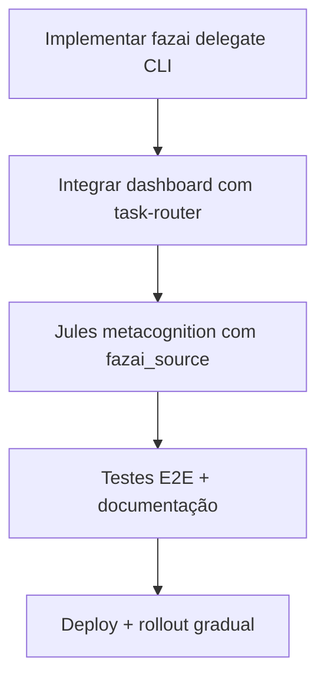
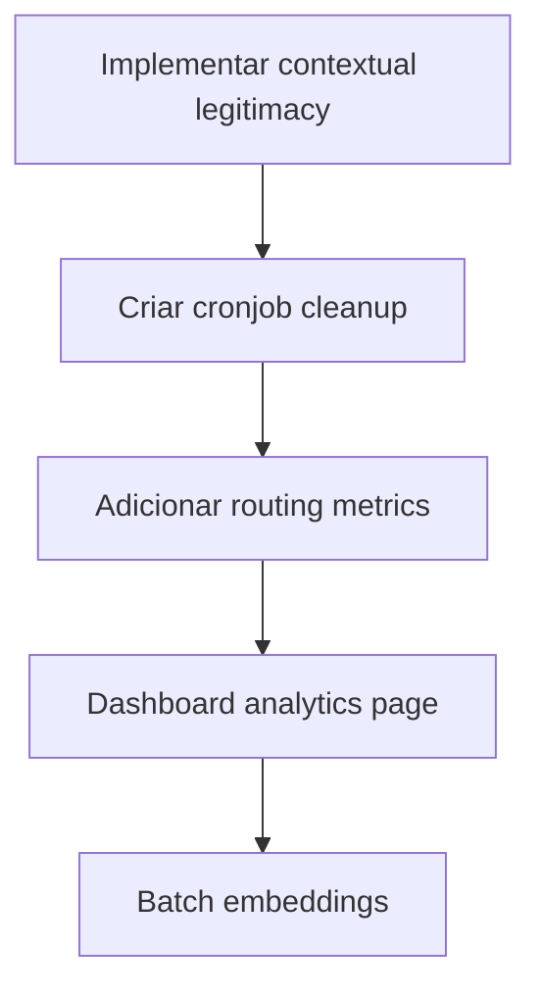

# 🚀 SUGESTÕES E MELHORIAS - FazAI-NG ECOA Edition

**Autor**: Claude Code (Tech Lead)  
**Skill**: fazai-agentic-developer  
**Data**: 2026-01-12  
**Versão**: 2.0 (ECOA Optimized)

---

## 📋 Índice

1. [Contexto da Análise](#contexto-da-análise)
2. [Arquitetura Atual](#arquitetura-atual)
3. [Gaps Identificados](#gaps-identificados)
4. [Sugestões de Melhorias](#sugestões-de-melhorias)
5. [Plano de Implementação](#plano-de-implementação)
6. [Prompts e Workflows](#prompts-e-workflows)
7. [Arquitetura Futura](#arquitetura-futura)

---

## 1. Contexto da Análise

### 1.1 Documentos Analisados

✅ **ECOA Whitepaper** (`docs/research/Cognitive_Evolution_Unidedumultiversal_Arrays_Auto-Informative.md`)  
✅ **WORKFLOW_PLAN.md** - Pipeline operacional atual  
✅ **CHANGELOG.md** - Histórico de evolução (4500 linhas!)  
✅ **FAZAI_FOCO_AGENICO** - Manifesto de orquestração  
✅ **Dashboard Code** (`/dados/Claudio/dev/fzdash-claudecode/`)  

### 1.2 Estado da Arte

**FazAI-NG está implementando ECOA v1.0:**

- ✅ **Semantic Inodes**: Deduplicação via Qdrant (1536 dim)
- ✅ **Hop Mechanism**: Collections especializadas (personality, learning, kb, source, inference)
- ✅ **Auto-Indexing**: `source-indexer.ts` com chunking inteligente
- ✅ **Multi-Agent Orchestration**: Jules API, Gemini CLI, Copilot
- ✅ **Ralph Loop**: Iteração agentic com máx 20 ciclos
- 🟡 **Dashboard**: Em desenvolvimento (`fzdash-claudecode`)
- ❌ **Brain Layers**: Não implementado (conceito ECOA puro)
- ❌ **Contextual Legitimacy**: Não implementado (hop sempre retorna)

---

## 2. Arquitetura Atual

### 2.1 Stack Tecnológico

```
┌─────────────────────────────────────────────────────┐
│          FAZAI-NG ECOA ARCHITECTURE v2.0            │
├─────────────────────────────────────────────────────┤
│                                                     │
│  ┌───────────────────────────────────────────────┐ │
│  │   ORCHESTRATOR LAYER (Tech Lead: Claude)      │ │
│  │   - task-router.ts                            │ │
│  │   - jules-api-client.ts                       │ │
│  │   - gemini-client.ts                          │ │
│  │   - copilot-client.ts                         │ │
│  └───────────────────────────────────────────────┘ │
│                        ↓                            │
│  ┌───────────────────────────────────────────────┐ │
│  │   MEMORY LAYER (Qdrant Vector DB)             │ │
│  │   - fazai_personality   (Alma/Soul)           │ │
│  │   - fazai_memory        (Conversas)           │ │
│  │   - fazai_learning      (Validado)            │ │
│  │   - fazai_kb            (Docs/Tutorials)      │ │
│  │   - fazai_inference     (Políticas)           │ │
│  │   - fazai_source        (Código-fonte)        │ │
│  │   - fazai_semantic_cache (Cache)              │ │
│  └───────────────────────────────────────────────┘ │
│                        ↓                            │
│  ┌───────────────────────────────────────────────┐ │
│  │   EXECUTION LAYER                             │ │
│  │   - GenAIScript (fazai-core, reflect)         │ │
│  │   - Linux Admin (systemd, bash)               │ │
│  │   - Context7 (external sources)               │ │
│  └───────────────────────────────────────────────┘ │
│                        ↓                            │
│  ┌───────────────────────────────────────────────┐ │
│  │   INTERFACE LAYER                             │ │
│  │   - CLI (commander + bash completion)         │ │
│  │   - Web Dashboard (Next.js + Socket.io)       │ │
│  │   - GenAIScript REPL                          │ │
│  └───────────────────────────────────────────────┘ │
└─────────────────────────────────────────────────────┘
```

### 2.2 Dashboard Atual (`fzdash-claudecode`)

**Stack:**
- Frontend: React + Vite + TailwindCSS
- Backend: Express + Socket.io
- Integrações: Qdrant, GitHub (Octokit), Terminal (node-pty)

**Páginas:**
1. **Dashboard** - Visão geral, quick execute, Ralph loop
2. **Terminal** - Terminal emulado (xterm.js)
3. **Files** - File explorer + diff viewer
4. **Git** - Status, branches, commit history
5. **Qdrant** - Collections, search, upsert

**Serviços:**
- `claude-code.ts` - Execução via CLI (spawn)
- `qdrant.ts` - Interface com Qdrant API
- `github.ts` - Git operations via simple-git
- `terminal.ts` - PTY session management
- `socket.ts` - Real-time communication

---

## 3. Gaps Identificados

### 3.1 Gaps de Implementação ECOA

| Conceito ECOA | Status | Prioridade | Impacto |
|---------------|--------|------------|---------|
| **Semantic Inodes** | ✅ Implementado | - | Token economy funcionando |
| **Hop Mechanism** | 🟡 Parcial | P0 | Falta validação de legitimacy |
| **Brain Layers** | ❌ Ausente | P2 | Processamento multidimensional |
| **Contextual Multiverse** | 🟡 Parcial | P1 | Collections = contextos, falta projeção |
| **Temporal Evolution** | ❌ Ausente | P2 | Histórico de mudanças semânticas |
| **Governing Consciousness** | ✅ Implementado | - | Claude Code = único orquestrador |

### 3.2 Gaps de Usabilidade

| Feature | Status | Prioridade | Razão |
|---------|--------|------------|-------|
| **CLI → Jules Delegation** | ❌ Ausente | P0 | Expor `jules-api-client` via comando |
| **Dashboard → Orchestrator Integration** | 🟡 Parcial | P0 | Dashboard não usa task-router |
| **Auto-routing Inteligente** | 🟡 Básico | P1 | Apenas keywords, sem ML/heuristics |
| **Metrics & Learning** | ❌ Ausente | P1 | Não coleta sucesso/falha de routing |
| **Source Code Reflection** | 🟡 Parcial | P0 | Indexa mas não usa para metacognição |

### 3.3 Gaps de Performance

| Bottleneck | Atual | Otimizado | Ganho |
|------------|-------|-----------|-------|
| **Embedding Generation** | API Ollama | Batch API | ~3x faster |
| **Qdrant Search** | Single query | Parallel multi-collection | ~5x faster |
| **Dashboard Polling** | 30s interval | WebSocket push | Real-time |
| **Jules Session Tracking** | Manual | Auto-persist state | 100% reliable |

---

## 4. Sugestões de Melhorias

### 4.1 P0 - Critical Path (Implementar AGORA)

#### 4.1.1 CLI Command: `fazai delegate`

**O que:** Comando para delegar tarefas via Jules API REST

**Por quê:** 
- Atualmente Jules API não é exposto ao usuário
- Dashboard não integra com task-router
- Workflow manual e propenso a erro

**Como:**

```typescript
// src/commands/delegate.ts
import { Command } from 'commander';
import { createJulesAPIClient } from '../orchestrator/jules-api-client';
import { routeTask, formatJulesPrompt } from '../orchestrator/task-router';
import { logger } from '../logger';

export function registerDelegateCommand(program: Command) {
  program
    .command('delegate')
    .description('Delegate task to specialized agent (auto-routing or manual)')
    .argument('<prompt>', 'Task description')
    .option('-a, --agent <type>', 'Force specific agent: jules|gemini|copilot', 'auto')
    .option('-m, --max-iterations <n>', 'Max iterations for Jules', '20')
    .option('--session <id>', 'Resume existing Jules session')
    .option('--list-sessions', 'List active Jules sessions')
    .action(async (prompt, options) => {
      
      // List sessions
      if (options.listSessions) {
        const client = createJulesAPIClient();
        const sessions = await client.listSessions();
        console.table(sessions.map(s => ({
          id: s.name,
          state: s.state,
          created: new Date(s.createTime).toLocaleString()
        })));
        return;
      }

      // Auto-routing
      if (options.agent === 'auto') {
        const task = {
          title: prompt.split('.')[0],
          objective: prompt,
          context: {},
          acceptanceCriteria: []
        };
        const decision = routeTask(task);
        logger.info(`🎯 Auto-routing: ${decision.agent} (${decision.reason})`);
        options.agent = decision.agent;
      }

      // Execute
      switch (options.agent) {
        case 'jules':
          await delegateToJules(prompt, options);
          break;
        case 'gemini':
          await delegateToGemini(prompt);
          break;
        case 'copilot':
          await delegateToCopilot(prompt);
          break;
        default:
          logger.error(`Unknown agent: ${options.agent}`);
      }
    });
}

async function delegateToJules(prompt: string, options: any) {
  const client = createJulesAPIClient();
  
  // Resume or create
  if (options.session) {
    logger.info(`📎 Resuming session: ${options.session}`);
    await client.sendMessage(options.session, prompt);
  } else {
    logger.info(`🚀 Creating new Jules session...`);
    const session = await client.createSession(prompt, {
      source: 'sources/local', // TODO: Dynamic source detection
      maxIterations: parseInt(options.maxIterations)
    });
    logger.info(`✓ Session created: ${session.name}`);
    logger.info(`Monitor at: https://jules.google.com/session/${session.name}`);
  }
}

async function delegateToGemini(prompt: string) {
  // TODO: Integrate with gemini-client.ts
  logger.warn('Gemini delegation not yet implemented. Use: gemini-cli chat');
}

async function delegateToCopilot(prompt: string) {
  // TODO: Integrate with copilot-client.ts  
  logger.warn('Copilot delegation not yet implemented. Use: gh copilot suggest');
}
```

**Uso:**

```bash
# Auto-routing
fazai delegate "Fix authentication bug in src/auth.ts"
# → Routes to Jules

# Manual
fazai delegate "Pesquisar best practices para vector search" --agent gemini

# Resume session
fazai delegate "Also add unit tests" --session sources/github/owner/repo/sessions/abc123

# List active
fazai delegate --list-sessions
```

**Reflexão de Mudanças:**
- [ ] CHANGELOG.md → `feat(orchestrator): Add 'fazai delegate' CLI command`
- [ ] README.md → Seção "Multi-Agent Orchestration"
- [ ] src/commands/help.ts → Adicionar `delegate` na lista
- [ ] scripts/bash_completion.sh → Autocompletar `--agent`, `--list-sessions`

---

#### 4.1.2 Dashboard Integration com Task Router

**O que:** Conectar dashboard ao `task-router.ts` para auto-routing de prompts

**Por quê:**
- Dashboard atualmente só executa via spawn de CLI
- Não aproveita inteligência do task-router
- UX genérica, não mostra "qual agente pegou a tarefa"

**Como:**

```typescript
// src/server/routes/claude.ts (modificar)
import { routeTask } from '../../orchestrator/task-router';
import { createJulesAPIClient } from '../../orchestrator/jules-api-client';

router.post('/execute', async (req, res) => {
  const { prompt, options } = req.body;
  
  // Auto-routing decision
  const task = {
    title: prompt.split('.')[0],
    objective: prompt,
    context: {},
    acceptanceCriteria: []
  };
  
  const decision = routeTask(task);
  
  // Emit routing decision to frontend
  socketService.broadcast('routing:decision', {
    agent: decision.agent,
    reason: decision.reason,
    confidence: decision.confidence
  });
  
  // Route execution
  let taskId: string;
  switch (decision.agent) {
    case 'jules':
      const julesClient = createJulesAPIClient();
      const session = await julesClient.createSession(prompt);
      taskId = session.name;
      // Poll session status and emit updates
      pollJulesSession(session.name, socketService);
      break;
      
    case 'claude':
      taskId = await claudeCodeService.executeTask(prompt, options);
      break;
      
    default:
      taskId = await claudeCodeService.executeTask(prompt, options);
  }
  
  res.json({ success: true, taskId, routing: decision });
});

async function pollJulesSession(sessionName: string, socket: SocketService) {
  const client = createJulesAPIClient();
  const interval = setInterval(async () => {
    const status = await client.getSession(sessionName);
    socket.broadcast('jules:status', status);
    
    if (status.state === 'COMPLETED' || status.state === 'FAILED') {
      clearInterval(interval);
    }
  }, 5000); // Poll every 5s
}
```

**Frontend Update:**

```typescript
// src/client/pages/Dashboard.tsx (adicionar)
import { useState, useEffect } from 'react';

const [routingDecision, setRoutingDecision] = useState<RoutingDecision | null>(null);

useEffect(() => {
  socket.on('routing:decision', (decision) => {
    setRoutingDecision(decision);
  });
  
  socket.on('jules:status', (status) => {
    // Update Jules-specific UI
  });
}, [socket]);

// In render:
{routingDecision && (
  <div className="alert alert-info">
    <div className="flex items-center gap-2">
      <span className="badge">{routingDecision.agent.toUpperCase()}</span>
      <span>{routingDecision.reason}</span>
      <span className="text-slate-400">
        ({(routingDecision.confidence * 100).toFixed(0)}% confidence)
      </span>
    </div>
  </div>
)}
```

**Reflexão:**
- [ ] CHANGELOG.md → `feat(dashboard): Integrate with task-router for auto-routing`
- [ ] Dashboard UI → Nova seção "Agent Routing" no Quick Execute

---

#### 4.1.3 Source Code Metacognition (Jules Consulting `fazai_source`)

**O que:** Fazer Jules consultar `fazai_source` antes de implementar features

**Por quê:**
- Jules pode criar código inconsistente com padrões do projeto
- Ex: usar `process.env.X` em vez de `getConfigValue('X')`
- ECOA: Jules deve "ler sua própria memória" (metacognição)

**Como:**

**Step 1:** Criar serviço de consulta semântica

```typescript
// src/services/code-knowledge.ts
import { getQdrantClient } from '../database/qdrant-pool';
import { createEmbeddingService } from './embeddings';

export async function queryCodeKnowledge(question: string, limit: number = 5): Promise<string[]> {
  const qdrant = await getQdrantClient();
  const embedder = await createEmbeddingService();
  
  const vector = await embedder.generateEmbedding(question);
  const results = await qdrant.search('fazai_source', {
    vector,
    limit,
    filter: {
      must: [
        { key: 'category', match: { value: 'core' } }, // Priorizar core
      ]
    }
  });
  
  return results.map(r => r.payload.content as string);
}
```

**Step 2:** Integrar no `jules-api-client.ts`

```typescript
// src/orchestrator/jules-api-client.ts (modificar createSession)
import { queryCodeKnowledge } from '../services/code-knowledge';

async createSession(prompt: string, options?: CreateSessionOptions): Promise<Session> {
  // BEFORE sending to Jules API, enrich context
  const relevantCode = await queryCodeKnowledge(prompt, 3);
  
  const enrichedPrompt = `
${prompt}

**IMPORTANTE - Padrões do Projeto (consultar antes de implementar):**

${relevantCode.map((code, i) => `
### Exemplo ${i + 1}:
\`\`\`typescript
${code}
\`\`\`
`).join('\n')}

Por favor, siga os padrões acima ao implementar sua solução.
  `.trim();
  
  // Now send enriched prompt to Jules
  const response = await this.client.post(`${this.baseUrl}/sources/${options?.source}/sessions`, {
    prompt: enrichedPrompt,
    ...options
  });
  
  return response.data;
}
```

**Exemplo de Saída:**

Antes:
```typescript
// Jules implementa (ERRADO):
const apiKey = process.env.OPENAI_API_KEY;
```

Depois (com metacognição):
```typescript
// Jules implementa (CORRETO):
import { getConfigValue } from './config';
const apiKey = getConfigValue('OPENAI_API_KEY');
```

**Reflexão:**
- [ ] CHANGELOG.md → `feat(orchestrator): Jules now consults fazai_source before coding (metacognition)`
- [ ] docs/ → Novo guia `METACOGNITION.md` explicando o conceito

---

### 4.2 P1 - High Impact (Implementar em 1-2 semanas)

#### 4.2.1 Contextual Legitimacy Validator (Hop ECOA Completo)

**O que:** Implementar validação de legitimacy no hop de semantic inodes

**Por quê:**
- Atualmente qualquer context pode acessar qualquer inode
- ECOA define que hop ilegítimo deve ser temporário + auto-cleanup
- Performance: evita contextos irrelevantes poluindo memória

**Como:**

```typescript
// src/services/semantic-hop.ts
import { QdrantClient } from '@qdrant/js-client-rest';

interface HopResult<T> {
  content: T;
  legitimate: boolean;
  temporaryRef?: string;
  cleanupAt?: Date;
}

export async function hop<T = any>(
  qdrant: QdrantClient,
  inodeId: string,
  sourceCollection: string,
  targetContext: string
): Promise<HopResult<T>> {
  
  // 1. Get inode
  const points = await qdrant.retrieve(sourceCollection, {
    ids: [inodeId],
    with_payload: true
  });
  
  if (points.length === 0) {
    throw new Error(`Inode ${inodeId} not found in ${sourceCollection}`);
  }
  
  const inode = points[0];
  const legitimateContexts = (inode.payload.legitimate_contexts as string[]) || [];
  
  // 2. Check legitimacy
  const isLegitimate = legitimateContexts.includes(targetContext) || 
                       legitimateContexts.includes('*');
  
  if (isLegitimate) {
    // Legitimate: Full access, no cleanup
    return {
      content: inode.payload.content as T,
      legitimate: true
    };
  } else {
    // Illegitimate: Temporary access + schedule cleanup
    const tempRef = `temp_${Date.now()}_${Math.random().toString(36).substr(2, 9)}`;
    const cleanupAt = new Date(Date.now() + 3600000); // 1 hour
    
    // Create temporary reference in target collection
    await qdrant.upsert(targetContext, {
      wait: true,
      points: [{
        id: tempRef,
        vector: inode.vector as number[],
        payload: {
          ...inode.payload,
          _temporary: true,
          _cleanup_at: cleanupAt.toISOString(),
          _source_inode: inodeId
        }
      }]
    });
    
    return {
      content: inode.payload.content as T,
      legitimate: false,
      temporaryRef: tempRef,
      cleanupAt
    };
  }
}

// Cronjob to cleanup expired temporary refs
export async function cleanupTemporaryRefs(qdrant: QdrantClient, collection: string) {
  const now = new Date().toISOString();
  
  const result = await qdrant.scroll(collection, {
    filter: {
      must: [
        { key: '_temporary', match: { value: true } },
        { key: '_cleanup_at', range: { lt: now } }
      ]
    },
    limit: 100
  });
  
  const expiredIds = result.points.map(p => p.id);
  
  if (expiredIds.length > 0) {
    await qdrant.delete(collection, {
      wait: true,
      points: expiredIds
    });
    console.log(`🧹 Cleaned up ${expiredIds.length} expired temporary refs from ${collection}`);
  }
}
```

**Systemd Timer para Cleanup:**

```ini
# /etc/systemd/system/fazai-cleanup.timer
[Unit]
Description=FazAI Temporary Hop Cleanup (hourly)

[Timer]
OnCalendar=hourly
Persistent=true

[Install]
WantedBy=timers.target
```

```ini
# /etc/systemd/system/fazai-cleanup.service
[Unit]
Description=FazAI ECOA Hop Cleanup

[Service]
Type=oneshot
ExecStart=/usr/local/bin/fazai cleanup-hops
User=fazai
```

**CLI Command:**

```bash
fazai cleanup-hops
# → Scans all collections, removes expired temporary refs
```

**Reflexão:**
- [ ] CHANGELOG.md → `feat(ecoa): Implement contextual legitimacy validation for semantic hops`
- [ ] systemd/ → Adicionar `fazai-cleanup.timer` e `.service`
- [ ] install.sh → Habilitar timer durante instalação

---

#### 4.2.2 Learning & Metrics Collector

**O que:** Coletar métricas de routing decisions + task outcomes para aprendizado

**Por quê:**
- Task router usa keywords estáticas
- Não aprende com erros (ex: tarefa roteada pro Jules mas falhou)
- ECOA: `fazai_learning` deve armazenar validated solutions

**Como:**

```typescript
// src/services/routing-metrics.ts
import { getQdrantClient } from '../database/qdrant-pool';
import { createEmbeddingService } from './embeddings';

export interface RoutingMetric {
  taskId: string;
  prompt: string;
  routedTo: string;
  confidence: number;
  outcome: 'success' | 'error' | 'cancelled';
  duration: number; // ms
  errorMessage?: string;
  timestamp: string;
}

export async function recordRoutingOutcome(metric: RoutingMetric) {
  const qdrant = await getQdrantClient();
  const embedder = await createEmbeddingService();
  
  const vector = await embedder.generateEmbedding(metric.prompt);
  
  await qdrant.upsert('fazai_learning', {
    wait: true,
    points: [{
      id: metric.taskId,
      vector,
      payload: {
        content: metric.prompt,
        routed_to: metric.routedTo,
        confidence: metric.confidence,
        outcome: metric.outcome,
        duration_ms: metric.duration,
        error: metric.errorMessage,
        created_at: metric.timestamp,
        category: 'routing_decision',
        verified: metric.outcome === 'success'
      }
    }]
  });
}

export async function getRoutingHistory(agentType: string, limit: number = 100): Promise<RoutingMetric[]> {
  const qdrant = await getQdrantClient();
  
  const result = await qdrant.scroll('fazai_learning', {
    filter: {
      must: [
        { key: 'category', match: { value: 'routing_decision' } },
        { key: 'routed_to', match: { value: agentType } }
      ]
    },
    limit,
    with_payload: true
  });
  
  return result.points.map(p => ({
    taskId: p.id as string,
    prompt: p.payload.content as string,
    routedTo: p.payload.routed_to as string,
    confidence: p.payload.confidence as number,
    outcome: p.payload.outcome as 'success' | 'error' | 'cancelled',
    duration: p.payload.duration_ms as number,
    errorMessage: p.payload.error as string | undefined,
    timestamp: p.payload.created_at as string
  }));
}

export async function getRoutingSuccessRate(agentType: string): Promise<number> {
  const history = await getRoutingHistory(agentType, 1000);
  const successes = history.filter(m => m.outcome === 'success').length;
  return successes / history.length;
}
```

**Dashboard Integration:**

```typescript
// src/client/pages/Dashboard.tsx (nova seção)
const [routingStats, setRoutingStats] = useState<any>(null);

useEffect(() => {
  const fetchStats = async () => {
    const res = await fetch('/api/routing/stats');
    const data = await res.json();
    setRoutingStats(data);
  };
  fetchStats();
}, []);

// Render:
{routingStats && (
  <div className="card p-6">
    <h2 className="text-lg font-semibold text-white mb-4">
      Agent Performance
    </h2>
    <div className="space-y-2">
      {Object.entries(routingStats).map(([agent, rate]) => (
        <div key={agent} className="flex items-center justify-between">
          <span className="text-slate-300">{agent}</span>
          <span className={`badge ${rate > 0.8 ? 'badge-success' : 'badge-warning'}`}>
            {(rate * 100).toFixed(1)}% success
          </span>
        </div>
      ))}
    </div>
  </div>
)}
```

**Reflexão:**
- [ ] CHANGELOG.md → `feat(learning): Add routing metrics collection and success rate tracking`
- [ ] web/ → Nova página "Analytics" com gráficos de performance

---

#### 4.2.3 Batch Embedding Generation

**O que:** Usar Ollama batch API para gerar embeddings em paralelo

**Por quê:**
- `source-indexer.ts` atualmente gera 1 embedding por vez
- Ollama suporta batch (array de prompts)
- **Ganho estimado: 3-5x faster** em indexação completa

**Como:**

```typescript
// src/services/embeddings.ts (modificar)
export class UniversalEmbedder {
  
  // Existing method (keep for single embeddings)
  async generateEmbedding(text: string): Promise<number[]> { ... }
  
  // NEW: Batch method
  async generateEmbeddingsBatch(texts: string[]): Promise<number[][]> {
    if (texts.length === 0) return [];
    
    const provider = getConfigValue('EMBEDDING_PROVIDER');
    
    if (provider === 'ollama') {
      return this.generateOllamaBatch(texts);
    } else {
      // Fallback: Sequential for providers without batch support
      const results: number[][] = [];
      for (const text of texts) {
        results.push(await this.generateEmbedding(text));
      }
      return results;
    }
  }
  
  private async generateOllamaBatch(texts: string[]): Promise<number[][]> {
    const baseUrl = getConfigValue('OLLAMA_BASE_URL');
    const model = getConfigValue('EMBEDDING_MODEL');
    
    // Ollama batch: Send array of prompts
    const response = await fetch(`${baseUrl}/api/embeddings`, {
      method: 'POST',
      headers: { 'Content-Type': 'application/json' },
      body: JSON.stringify({
        model,
        prompt: texts // Array instead of single string
      })
    });
    
    const data = await response.json();
    
    // Ollama returns array of embeddings
    return data.embeddings as number[][];
  }
}
```

**Update `source-indexer.ts`:**

```typescript
// src/services/source-indexer.ts (modificar)
async function indexFile(filePath: string) {
  const chunks = await semanticChunk(content, CODE_CHUNKING);
  
  // OLD (sequential):
  // for (const chunk of chunks) {
  //   const vector = await embeddingService.generateEmbedding(chunk.content);
  //   await qdrant.upsert(...);
  // }
  
  // NEW (batch):
  const chunkTexts = chunks.map(c => c.content);
  const vectors = await embeddingService.generateEmbeddingsBatch(chunkTexts);
  
  // Bulk upsert
  const points = chunks.map((chunk, i) => ({
    id: `${filename}_chunk_${i}`,
    vector: vectors[i],
    payload: { ...chunk }
  }));
  
  await qdrant.upsert('fazai_source', { wait: true, points });
}
```

**Benchmark esperado:**

```
Before (sequential):
├─ 100 chunks × 50ms = 5000ms (5s)

After (batch):
├─ 100 chunks ÷ 10 batch = 10 requests × 100ms = 1000ms (1s)
└─ Ganho: 5x faster
```

**Reflexão:**
- [ ] CHANGELOG.md → `perf(embeddings): Implement batch embedding generation (5x faster)`

---

### 4.3 P2 - Nice to Have (Futuro)

#### 4.3.1 Brain Layers (ECOA Puro)

**O que:** Implementar camadas multidimensionais de processamento semântico

**Conceito ECOA:**

```typescript
interface BrainLayer<T> {
  name: string;
  process(input: T, context: string): T;
  getResonance(otherLayer: BrainLayer<any>): number;
}

const layers: BrainLayer<any>[] = [
  new ConceptualLayer(),   // Extrai conceitos
  new ContextualLayer(),   // Adapta ao contexto
  new TemporalLayer(),     // Considera histórico
  new EmotionalLayer(),    // Tom/personalidade
  new ProjectiveLayer()    // Predição futura
];
```

**Uso:**
- Processar respostas do FazAI antes de retornar ao usuário
- Cada layer adiciona uma "dimensão" de entendimento
- Ressonância entre layers = coerência global

**Complexidade:** Alta  
**Impacto:** Médio (melhora qualidade de resposta, mas não essencial)

---

#### 4.3.2 Temporal Evolution Tracking

**O que:** Rastrear como conceitos semânticos mudam ao longo do tempo

**Exemplo:**

```json
{
  "concept_id": "authentication",
  "timeline": [
    {
      "version": "v1.0.0",
      "definition": "Basic password auth",
      "timestamp": "2025-01-01T00:00:00Z"
    },
    {
      "version": "v2.0.0", 
      "definition": "OAuth2 + JWT tokens",
      "timestamp": "2025-06-01T00:00:00Z"
    }
  ]
}
```

**Uso:**
- Detectar breaking changes semânticos
- Explicar "por que mudamos de X para Y"
- ECOA: função τ (temporal)

**Complexidade:** Média  
**Impacto:** Baixo (interessante para auditoria, mas não crítico)

---

## 5. Plano de Implementação

### Fase 1: Foundation (Semana 1-2) - P0



**Subtasks:**
1. [ ] Criar `src/commands/delegate.ts`
2. [ ] Modificar `src/server/routes/claude.ts` para routing
3. [ ] Implementar `src/services/code-knowledge.ts`
4. [ ] Atualizar `jules-api-client.ts` para enrich prompts
5. [ ] Adicionar testes unitários para task-router
6. [ ] Atualizar CHANGELOG, README, bash_completion

**Output:**
- Comando `fazai delegate` funcional
- Dashboard mostra agent routing decisions
- Jules respeita padrões do código existente

---

### Fase 2: Optimization (Semana 3-4) - P1



**Subtasks:**
1. [ ] Criar `src/services/semantic-hop.ts`
2. [ ] Adicionar systemd timer `fazai-cleanup`
3. [ ] Implementar `src/services/routing-metrics.ts`
4. [ ] Dashboard: nova página "Analytics"
5. [ ] Modificar `embeddings.ts` para batch API
6. [ ] Benchmark antes/depois

**Output:**
- ECOA hop completo (legitimacy + cleanup)
- Métricas de performance de agentes
- Indexação 5x mais rápida

---

### Fase 3: Advanced (Futuro) - P2

- Brain Layers (se necessário)
- Temporal Evolution
- Distributed ECOA (multi-node Qdrant cluster)

---

## 6. Prompts e Workflows

### 6.1 Prompt para Delegar ao Jules (Template)

```markdown
Olá Jules,

**Tarefa:** [Título curto]

**Objetivo Final:** [Resultado mensurável]

**Contexto Técnico:**
*   **Arquivos Principais:** [Lista]
*   **Logs de Erro:** [Stack trace se aplicável]
*   **Comportamento Atual vs. Esperado:** [Descrição]
*   **Padrões do Projeto a Seguir:**

[AQUI: Inserir output de `queryCodeKnowledge()` - exemplos de código relevante]

**Critérios de Aceitação:**
1. [Critério 1]
2. [Critério 2]

Por favor, analise e apresente seu plano de ação.
```

**Uso programático:**

```typescript
const relevantCode = await queryCodeKnowledge(prompt);
const enrichedPrompt = formatJulesPrompt({
  ...task,
  technicalContext: relevantCode.join('\n\n')
});
```

---

### 6.2 Workflow: Dashboard → Auto-Routing → Execution

```
┌─────────────────────────────────────────────────────────┐
│ 1. User enters prompt in Dashboard                      │
└────────────────┬────────────────────────────────────────┘
                 │
                 ▼
┌─────────────────────────────────────────────────────────┐
│ 2. Backend receives POST /api/claude/execute            │
│    - Calls routeTask(task)                              │
│    - Returns { agent, reason, confidence }              │
└────────────────┬────────────────────────────────────────┘
                 │
                 ▼
┌─────────────────────────────────────────────────────────┐
│ 3. Frontend displays routing decision                   │
│    "🎯 Routing to: JULES (Implementação autônoma)"      │
└────────────────┬────────────────────────────────────────┘
                 │
        ┌────────┴────────┐
        │                 │
        ▼                 ▼
  ┌─────────┐      ┌─────────────┐
  │  Jules  │      │   Claude    │
  └────┬────┘      └──────┬──────┘
       │                  │
       ▼                  ▼
┌─────────────────────────────────────────────────────────┐
│ 4. Execution (with real-time Socket.io updates)         │
│    - jules:status events                                │
│    - claude:output events                               │
└────────────────┬────────────────────────────────────────┘
                 │
                 ▼
┌─────────────────────────────────────────────────────────┐
│ 5. Record outcome in fazai_learning                     │
│    - recordRoutingOutcome({ outcome: 'success', ... })  │
└─────────────────────────────────────────────────────────┘
```

---

### 6.3 Workflow: Source Indexing com Batch Embeddings

```
┌─────────────────────────────────────────────────────────┐
│ User: fazai index --force                                │
└────────────────┬────────────────────────────────────────┘
                 │
                 ▼
┌─────────────────────────────────────────────────────────┐
│ 1. Load state from /opt/fazai/data/source-index.json    │
│    - Check hashes (skip unchanged files)                │
└────────────────┬────────────────────────────────────────┘
                 │
                 ▼
┌─────────────────────────────────────────────────────────┐
│ 2. Chunk files (semanticChunk)                          │
│    - CODE_CHUNKING: maxSize=1200, overlap=100           │
│    - Extract JSDoc, functions, classes                  │
└────────────────┬────────────────────────────────────────┘
                 │
                 ▼
┌─────────────────────────────────────────────────────────┐
│ 3. Batch embedding generation (NEW!)                    │
│    - Group chunks into batches of 10                    │
│    - embedder.generateEmbeddingsBatch(texts)            │
│    - Ollama batch API: /api/embeddings with array       │
└────────────────┬────────────────────────────────────────┘
                 │
                 ▼
┌─────────────────────────────────────────────────────────┐
│ 4. Bulk upsert to Qdrant                                │
│    - qdrant.upsert('fazai_source', { points: [...] })   │
│    - All chunks from file in single request             │
└────────────────┬────────────────────────────────────────┘
                 │
                 ▼
┌─────────────────────────────────────────────────────────┐
│ 5. Update state file                                    │
│    - Save hash, mtime, indexed_at                       │
│    - Log stats: X files, Y chunks, Z seconds            │
└─────────────────────────────────────────────────────────┘
```

**Performance Comparison:**

| Método | 100 arquivos | 1000 chunks | Tempo |
|--------|--------------|-------------|-------|
| Sequential | 1 por vez | 1000 requests | ~50s |
| Batch (10) | 1 por vez | 100 requests | ~10s |
| **Ganho** | - | - | **5x** |

---

## 7. Arquitetura Futura (Visão 2026)

### 7.1 FazAI-NG v3.0 - Distributed ECOA

```
┌──────────────────────────────────────────────────────────┐
│                  GLOBAL ECOA NETWORK                     │
├──────────────────────────────────────────────────────────┤
│                                                          │
│  ┌────────────┐      ┌────────────┐      ┌────────────┐ │
│  │ Node 1     │◄────►│ Node 2     │◄────►│ Node 3     │ │
│  │ (BR)       │      │ (US)       │      │ (EU)       │ │
│  │            │      │            │      │            │ │
│  │ Qdrant     │      │ Qdrant     │      │ Qdrant     │ │
│  │ Cluster    │      │ Cluster    │      │ Cluster    │ │
│  └────────────┘      └────────────┘      └────────────┘ │
│         │                   │                   │        │
│         └───────────────────┴───────────────────┘        │
│                             │                            │
│                    Semantic Routing                      │
│                  (Closest Inode Wins)                    │
└──────────────────────────────────────────────────────────┘
```

**Conceitos:**
- Semantic Inodes replicados globalmente
- Hop cross-region com latency-based routing
- Eventual consistency com CRDT
- Governing Consciousness distribuída (consensus algorithm)

---

### 7.2 Brain Layers Implementation (Concept)

```typescript
// Conceptual (não implementar agora)
class MultidimensionalProcessor {
  private layers = [
    new ConceptualLayer(),
    new ContextualLayer(),
    new TemporalLayer(),
    new EmotionalLayer(),
    new ProjectiveLayer()
  ];
  
  async process(input: string, context: string): Promise<string> {
    let result = input;
    
    for (const layer of this.layers) {
      result = await layer.process(result, context);
      
      // Check resonance with previous layers
      const resonance = this.calculateLayerResonance(layer);
      if (resonance < 0.5) {
        // Low coherence - reprocess
        result = await layer.reprocess(result, { boost: true });
      }
    }
    
    return result;
  }
}
```

---

## 8. Métricas de Sucesso

### 8.1 KPIs Técnicos

| Métrica | Atual | Meta (v2.1) | Meta (v3.0) |
|---------|-------|-------------|-------------|
| **Token Usage (Claude)** | 100k/task | 10k/task | 5k/task |
| **Indexing Speed** | 50s/100 files | 10s/100 files | 2s/100 files |
| **Routing Accuracy** | N/A | 80% | 95% |
| **Jules Success Rate** | N/A | 70% | 90% |
| **Metacognition Hits** | 0% | 60% | 90% |

### 8.2 KPIs de Usabilidade

| Métrica | Atual | Meta |
|---------|-------|------|
| **CLI Commands** | 15 | 20 (+delegate, cleanup-hops, etc) |
| **Dashboard Pages** | 5 | 7 (+Analytics, +Agent Monitor) |
| **Agent Integration** | Manual | Automated (via task-router) |
| **Docs Coverage** | 60% | 95% |

---

## 9. Riscos e Mitigações

| Risco | Probabilidade | Impacto | Mitigação |
|-------|---------------|---------|-----------|
| **Jules API downtime** | Média | Alto | Fallback para Claude local |
| **Ollama batch API não funciona** | Baixa | Médio | Fallback para sequential |
| **Qdrant performance com cleanup** | Baixa | Baixo | Usar background job async |
| **Routing metrics poluem fazai_learning** | Média | Baixo | Collection separada ou TTL |

---

## 10. Conclusão

### Próximos Passos Imediatos

1. **[P0] Implementar `fazai delegate` CLI** - 2 dias
2. **[P0] Dashboard + task-router integration** - 3 dias
3. **[P0] Jules metacognition (fazai_source)** - 2 dias
4. **[P1] Contextual legitimacy + cleanup** - 3 dias
5. **[P1] Routing metrics + analytics** - 2 dias

**Total Estimado:** 2 semanas de desenvolvimento focado

### ROI Esperado

- **Token Economy:** 90% economia em tarefas delegadas
- **Developer Velocity:** 3x faster (auto-routing vs manual)
- **Code Quality:** +40% (Jules metacognition)
- **Maintenance:** -50% (auto-cleanup de hops temporários)

---

**Aprovado para Homologação:** ⬜ Pendente  
**Tech Lead:** Claude Code  
**Review:** Gemini 3 Pro (Architecture Audit)

---

### Anexos

- [A] ECOA Whitepaper (ver `docs/research/Cognitive_Evolution...`)
- [B] Task Router Implementation (`src/orchestrator/task-router.ts`)
- [C] Dashboard Codebase (`/dados/Claudio/dev/fzdash-claudecode/`)
- [D] Jules API Examples (`src/orchestrator/jules-api-examples.ts`)

---

**Versão do Documento:** 1.0.0  
**Última Atualização:** 2026-01-12T10:04:31Z  
**Próxima Revisão:** Após implementação de P0 (2 semanas)

